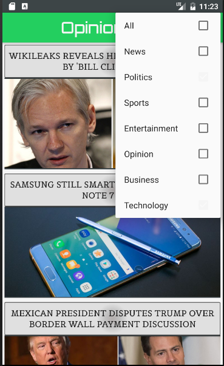
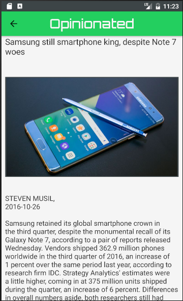

#Android front end

Written using Android Studio.
The JSON file of articles is currently saved locally in the assets folder as no server is hosted yet. 
To run just download the code and emulate with android API 16 or later.

###Here is a Wire-Frame of the app design

###Development Goals
- <s>layout front page</s>
- <s>setup app style and themes</s>
- <s>read json file and create buttons</s>
- <s>create article view layout/activity</s>
- <s>link buttons to build article view layout</s>
- <s>stylize the article viewer activity and add imageview</s>
- <s>create similar articles layout/activity</s>
- adjust styling for similar activities layout
- <s>link to other articles from similar articles activity</s>
- <s>add fullscreen imageview activity</s>
- stylize fullscreen imageview activity
- link the app to backend

###Introduction

####Below is the landing page of the app, this is where articles are displayed as cards displaying the article title and image. Touching the cards launches the articleViewer activity.

)

####This photograph shows the drop down menu for sorting articles. Multiple tags can be selected to only load articles of a certain category.

####This is the article viewer page, it's a scrollview that displays the articles title, author, image, and text. Tapping the image will launch the fullscreen imageview. Swiping from the right side of the screen will open the similar articles navigation drawer.

####This is the similar articles navigation drawer. Articles similar to the current article are displayed, tapping on a similar article will launch it in the articleViewer activity.

####If you have any questions, comments, contributions, or concerns feel free to submit a pull request or submit an issue.
